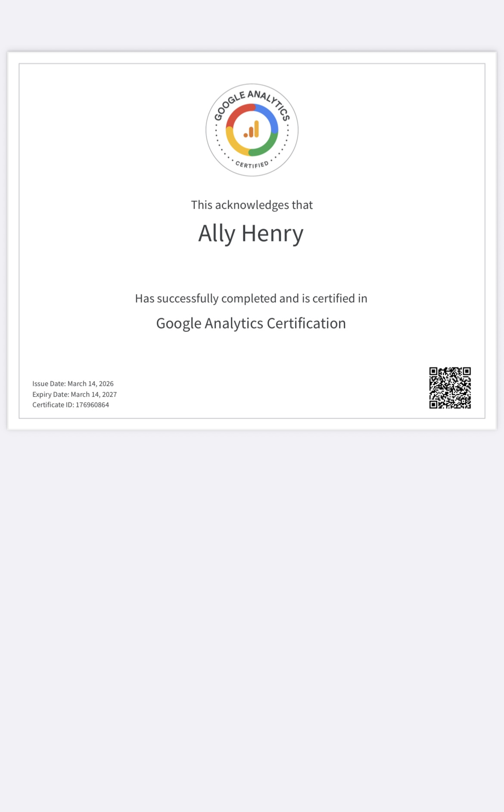
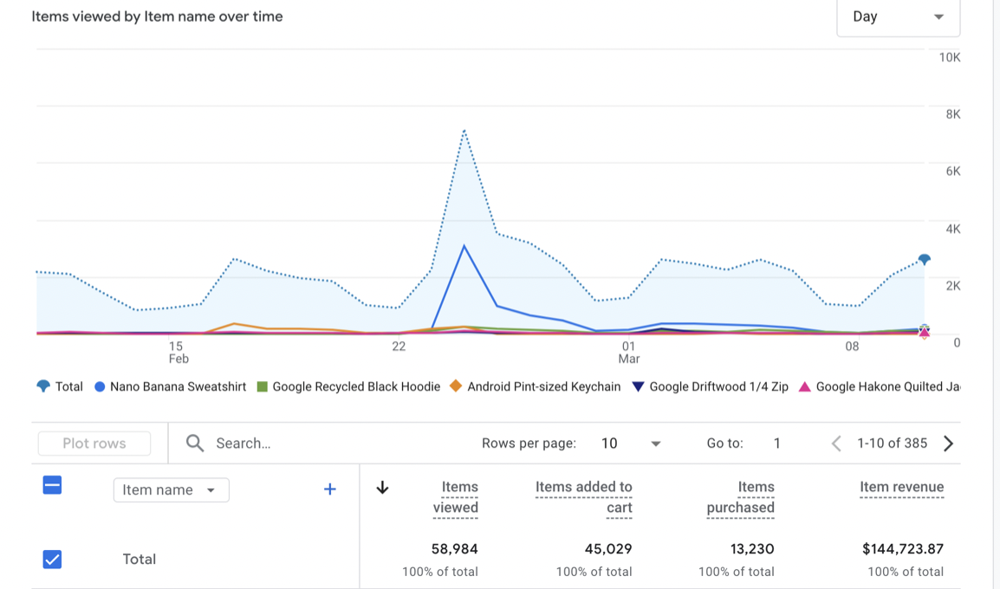

## Proof of Completion



## Exam Reflection

**Results:** I successfully completed the Google Analytics 4 Certification exam with a score of 90%.

**Top 3 Challenging Topics**

-   **Enhanced Measurement:** I found it tricky to remember which events GA4 tracks automatically (like scrolls or clicks) and which ones I still have to set up manually as "Custom Events" to get the data I actually need.
-   **Dimensions vs. Metrics:** It took a minute to truly grasp that **Dimensions** are the "what" (like a user's city) and **Metrics** are the "numbers" (like how many users). If you mix them up, your reports just stay empty.
-   **Data Streams:** I had to learn that one **Property** can have multiple **Data Streams** (like one for a website and one for an app), which is how GA4 tracks the same person across different devices.

**Two Questions (Topics) I wish I could Redo**

I would like to redo the questions regarding Funnel Explorations, specifically the difference between "open" and "closed" funnels, to better understand how to track user drop-off points accurately. I also wish I could revisit the area of Reporting Identity, as it was challenging to remember how switching between "Blended" and "Observed" settings changes how user data is modeled and displayed in my reports.

**CEP Connection**

Because of what I learned, I decided to change how I tracked Key Events in my analysis plan. After exploring the Google Demo account, I realized I was focusing on too many minor actions, so I shifted my strategy to only prioritize "high-value" events like purchases. This made my conversion data much more accurate and allowed me to clearly identify which marketing channels were actually driving results.

#### GA4 “readiness check”

KPI: Items Purchased (or Item Revenue)

Supporting Report: Ecommerce purchases: Item name

Why: I selected this KPI because it tracked exactly which products were generating the most interest and sales. By using the Ecommerce purchases report, I was able to compare "Items viewed" against "Items purchased," which helped me identify which specific items had the highest conversion intent for the Google Merchandise Store.



## Quarto

Quarto enables you to weave together content and executable code into a finished document. To learn more about Quarto see <https://quarto.org>.

## Running Code

When you click the **Render** button a document will be generated that includes both content and the output of embedded code. You can embed code like this:

```{r}
1 + 1
```

You can add options to executable code like this

```{r}
#| echo: false
2 * 2
```

The `echo: false` option disables the printing of code (only output is displayed).
